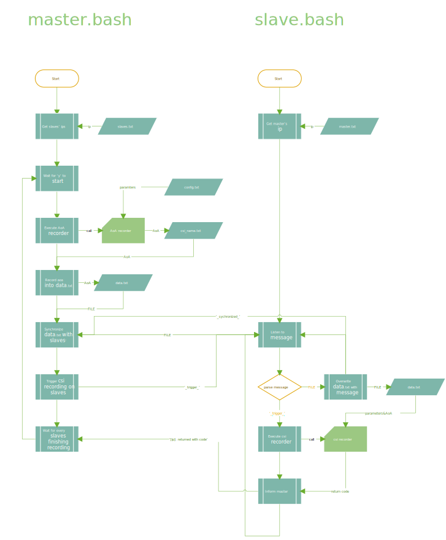

# csi recorder

## Install

### **master**

- Copy ```master``` folder to master device
- Write slaves' ip addresses in ```slaves.txt```. ONE IP PER LINE, NO EMPTY LINE

### **slaves**

- Write slaves' ip addresses in ```master.txt```. 
- Copy ```slave``` folder with the modified ```master.txt``` to each slave device
- Replace ```run your csi recorder here``` in ```slave.bash``` with execution of your own csi recording program

```bash
#############################################################
            # access parameters stored in data.txt
            aoa=$(awk NR==1 ${data_path})
            para1=$(awk NR==2 ${data_path})
            para2=$(awk NR==3 ${data_path})
            para3=$(awk NR==4 ${data_path})
            #...

            echo "recording csi..."
            # result=$(run your csi recorder here)
            echo -e "done\n"
#############################################################
```

parameters can be accessed via

```bash
            # access parameters stored in data.txt
            aoa=$(awk NR==1 ${data_path})
            para1=$(awk NR==2 ${data_path})
            para2=$(awk NR==3 ${data_path})
            para3=$(awk NR==4 ${data_path})
            #...
```

## Usage

### **master**

- Run ```master.bash```

### **slaves**

- Run ```slave.bash```

## Note

- If ```master.bash``` stucks with echo:

```
listening to result returned by slaves...
```

That means one or more of slave devices have not finished recording. Please either wait or check out the slaves. After that you may need to rerun ```slave.bash``` on that device and ```master.txt``` on master device.